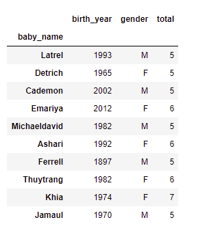

# Curious about what to name your baby?

## ETL_project_group_0

### Contributors
1. Nadia Aldrich
2. Shayet Makoshi

Background:

##Extract:
Source: https://www.ssa.gov/oact/babynames/background.html

###Data formatted using:
-Visual Sudio Code
-pgAdmin
-Jupyter Notebook

##Transformation:
- Converted raw data from a text file to a CSV file
- Read CSV file into jupyter notebook and created dataframes for each file.
- Dropped duplicates
- Reanmed columns

###Data Requirements:

*a. Names need to be at least 2 characters long and State of Birth, Year of birth, and Gender have to be recorded*
*b. Hyphens and spaces are removed (ex. "Julie-Anne, Julie Anne, and Julieanne will be counted as a single entry").*
*c. Names spelled similarly are not combined (ex. "Caitlin, Caitlyn, Kaitlin, Kaitlyn, Kaitlynn, Katelyn, and Katelynn are considered separate names and each has its own rank.")*
*d. For privacy reasons, names that appear fewer than 5 in a geographical area are not included in the data*

##Load

