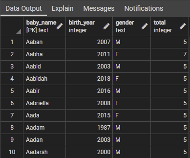

# ETL Project Group 0

## The Most Popular US Baby Names
*by Shayet Makoshi and Nadia Aldrich*

## Background
Ever wonder what the most popular baby names were in 1880 or 1980? If your answer is yes, then we have something in common.
Now, have you ever wondered if there is reliable data to investigate such a question? You're wondering: _"Yes, is there? Hmmm."_ :thinking:

 

## Well, here is what we found...
The Social Security Administration has been gathering and storing information on all qualifying applicants from **1880 to 2021**. The information collected includes the **name of the applicant**, **birth year**, **place of birth**, and **gender**.

But it wasn't until 1998 that an Actuary by the name of **_*Michael W. Shackleford*_** analyzed the distribution of names of Social Security holders and pioneered the idea for [the website](https://www.ssa.gov/oact/babynames/background.html) where this data is stored and is ready to use.

## The extraction challenge...
- Original files were separate `.TXT` files--a set of files for **National Data** and **State Data**
- We downloaded the files and overheated our machines because these files were HUGE.

## The data make-over...
- Converted all the `.TXT` files into one `csv` file for **National Data** and one for **Alaska Data**
- Used `.drop_duplicates` since "Julie-Anne, Julie Anne and Julieanne" count as a single entry
- Used `.rename` to update headers since the originals included keywords like **_*Name*_** and **_*Count*_**.

## The loading of data...
- Created a database using `pgAdmin 4` and created tables for **National Data** and **Alaska Data**
- Created a connection from our Pandas library in `Jupyter notebook` to our tables in `pgAdmin 4`

## Voilà...

### Alaska Data

### National Data

##### And if you're still curious...

###### Alaska's top 5 girl names (2019)
- Emma
- Evelyn
- Amelia
- Ava
- Olivia

###### Alaska's top 5 boy names (2019)
- Liam
- Oliver
- Henry
- James
- Noah
